# 테몬 MBTI 플랫폼 배포 가이드

## 🚀 배포 개요

이 문서는 테몬 MBTI 플랫폼을 Vercel, GitHub, Supabase를 활용하여 배포하는 방법을 설명합니다.

---

## 📋 사전 준비사항

### 1. 필요한 계정 및 도구
- [ ] GitHub 계정
- [ ] Vercel 계정
- [ ] Supabase 계정
- [ ] Google Analytics 계정
- [ ] Google AdSense 계정 (선택사항)

### 2. 로컬 개발 환경
```bash
# 필수 도구 설치
- Node.js 18+
- pnpm (패키지 매니저)
- Git
- VS Code (권장)
```

---

## 🗄️ 1. Supabase 설정

### 1.1 프로젝트 생성
1. [Supabase 대시보드](https://supabase.com/dashboard) 접속
2. "New Project" 클릭
3. 프로젝트 정보 입력:
   - **Name**: temon-mbti
   - **Database Password**: 강력한 비밀번호 설정
   - **Region**: Asia Northeast (Seoul) 선택
4. 프로젝트 생성 완료 대기 (약 2-3분)

### 1.2 데이터베이스 스키마 설정
```bash
# 1. Supabase SQL Editor에서 스키마 실행
# supabase/schema.sql 파일의 내용을 복사하여 실행

# 2. 또는 Supabase CLI 사용 (권장)
npx supabase init
npx supabase db push
```

### 1.3 Storage 버킷 생성
1. Supabase 대시보드 → Storage
2. "Create a new bucket" 클릭
3. 버킷 설정:
   - **Name**: public
   - **Public**: true (체크)
   - **File size limit**: 50MB
   - **Allowed MIME types**: image/*

### 1.4 환경 변수 확인
Supabase 대시보드 → Settings → API에서 다음 정보 확인:
- Project URL
- anon public key
- service_role key

---

## 🔧 2. GitHub 설정

### 2.1 저장소 생성
```bash
# 1. GitHub에서 새 저장소 생성
# Repository name: temon-mbti
# Description: 테몬 MBTI 플랫폼
# Public/Private 선택

# 2. 로컬에서 Git 초기화
git init
git add .
git commit -m "Initial commit"
git branch -M main
git remote add origin https://github.com/[username]/temon-mbti.git
git push -u origin main
```

### 2.2 GitHub Secrets 설정
Repository → Settings → Secrets and variables → Actions에서 다음 secrets 추가:

```
NEXT_PUBLIC_SUPABASE_URL=your_supabase_project_url
NEXT_PUBLIC_SUPABASE_ANON_KEY=your_supabase_anon_key
SUPABASE_SERVICE_ROLE_KEY=your_supabase_service_role_key
NEXT_PUBLIC_GA_ID=G-XXXXXXXXXX
NEXT_PUBLIC_ADSENSE_CLIENT=ca-pub-XXXXXXXXXX
VERCEL_TOKEN=your_vercel_token
VERCEL_ORG_ID=your_vercel_org_id
VERCEL_PROJECT_ID=your_vercel_project_id
```

### 2.3 브랜치 보호 규칙 설정
Repository → Settings → Branches에서:
- main 브랜치에 대한 보호 규칙 활성화
- Require pull request reviews before merging
- Require status checks to pass before merging

---

## ⚡ 3. Vercel 설정

### 3.1 프로젝트 연결
1. [Vercel 대시보드](https://vercel.com/dashboard) 접속
2. "Import Project" 클릭
3. GitHub 저장소 선택: temon-mbti
4. 프로젝트 설정:
   - **Framework Preset**: Next.js
   - **Root Directory**: ./
   - **Build Command**: pnpm build
   - **Output Directory**: .next
   - **Install Command**: pnpm install

### 3.2 환경 변수 설정
Vercel 대시보드 → Project → Settings → Environment Variables에서:

```
NEXT_PUBLIC_SUPABASE_URL=your_supabase_project_url
NEXT_PUBLIC_SUPABASE_ANON_KEY=your_supabase_anon_key
SUPABASE_SERVICE_ROLE_KEY=your_supabase_service_role_key
NEXT_PUBLIC_GA_ID=G-XXXXXXXXXX
NEXT_PUBLIC_ADSENSE_CLIENT=ca-pub-XXXXXXXXXX
NEXT_PUBLIC_APP_URL=https://temon.kr
NEXT_PUBLIC_APP_NAME=테몬 MBTI
```

### 3.3 도메인 설정
1. Vercel 대시보드 → Project → Settings → Domains
2. Custom Domain 추가:
   - **Domain**: temon.kr
   - **Type**: Apex Domain
3. DNS 설정 (도메인 제공업체에서):
   ```
   Type: A
   Name: @
   Value: 76.76.19.61
   
   Type: CNAME
   Name: www
   Value: cname.vercel-dns.com
   ```

### 3.4 Vercel CLI 설정 (선택사항)
```bash
# Vercel CLI 설치
npm i -g vercel

# 프로젝트 연결
vercel link

# 환경 변수 동기화
vercel env pull .env.local
```

---

## 📊 4. Google Analytics 설정

### 4.1 GA4 속성 생성
1. [Google Analytics](https://analytics.google.com) 접속
2. "Create Property" 클릭
3. 속성 설정:
   - **Property name**: 테몬 MBTI
   - **Reporting time zone**: Asia/Seoul
   - **Currency**: KRW

### 4.2 데이터 스트림 설정
1. "Add stream" → "Web" 선택
2. 웹사이트 정보 입력:
   - **Website URL**: https://temon.kr
   - **Stream name**: 테몬 MBTI 웹사이트
3. Measurement ID 복사 (G-XXXXXXXXXX 형식)

### 4.3 이벤트 설정
GA4에서 다음 커스텀 이벤트 설정:
- test_start
- test_progress
- test_complete
- share
- upload_file

---

## 💰 5. Google AdSense 설정

### 5.1 AdSense 계정 생성
1. [Google AdSense](https://www.google.com/adsense) 접속
2. 계정 생성 및 사이트 등록
3. 사이트 승인 대기 (보통 1-2주 소요)

### 5.2 광고 단위 생성
1. AdSense 대시보드 → Ads → By ad unit
2. 광고 단위 생성:
   - **Type**: Display ads
   - **Size**: Responsive
   - **Name**: 테몬 MBTI 메인 광고

### 5.3 광고 코드 통합
생성된 광고 코드를 `app/layout.tsx`에 추가:
```tsx
<Script
  async
  src="https://pagead2.googlesyndication.com/pagead/js/adsbygoogle.js?client=ca-pub-XXXXXXXXXX"
  crossOrigin="anonymous"
  strategy="afterInteractive"
/>
```

---

## 🔄 6. CI/CD 파이프라인

### 6.1 GitHub Actions 워크플로우
`.github/workflows/deploy.yml` 파일이 자동으로 다음 작업을 수행:

1. **코드 품질 검사**:
   - ESLint 실행
   - TypeScript 타입 체크
   - 테스트 실행

2. **빌드 및 배포**:
   - Pull Request: Preview 배포
   - Main 브랜치: Production 배포

### 6.2 배포 프로세스

```mermaid
graph LR
    A[코드 푸시] --> B[GitHub Actions]
    B --> C[테스트 실행]
    C --> D[빌드]
    D --> E[Vercel 배포]
    E --> F[도메인 업데이트]
```


---

## 🧪 7. 테스트 및 검증

### 7.1 배포 후 체크리스트
- [ ] 홈페이지 정상 로드
- [ ] 테스트 페이지 정상 작동
- [ ] 사용자 인증 기능
- [ ] 파일 업로드 기능
- [ ] Google Analytics 추적
- [ ] AdSense 광고 표시
- [ ] 모바일 반응형 확인
- [ ] SEO 메타태그 확인

### 7.2 성능 테스트
```bash
# Lighthouse 성능 테스트
npx lighthouse https://temon.kr --output html --output-path ./lighthouse-report.html

# Core Web Vitals 확인
# Google PageSpeed Insights 사용
```

### 7.3 보안 테스트
- [ ] HTTPS 인증서 확인
- [ ] CORS 설정 확인
- [ ] XSS 보호 확인
- [ ] CSRF 보호 확인

---

## 📈 8. 모니터링 및 유지보수

### 8.1 모니터링 도구
- **Vercel Analytics**: 실시간 성능 지표
- **Google Analytics**: 사용자 행동 분석
- **Supabase Dashboard**: 데이터베이스 모니터링
- **GitHub Actions**: CI/CD 상태 모니터링

### 8.2 정기 점검 항목
- **일일**: 시스템 가동률, 에러 로그
- **주간**: 성능 지표, 사용자 피드백
- **월간**: 보안 업데이트, 백업 확인

### 8.3 백업 전략
- **데이터베이스**: Supabase 자동 백업 (일일)
- **코드**: GitHub 저장소
- **파일**: Supabase Storage
- **환경 설정**: Vercel 환경 변수

---

## 🚨 9. 트러블슈팅

### 9.1 일반적인 문제들

#### 빌드 실패
```bash
# 로컬에서 빌드 테스트
pnpm build

# 의존성 문제 해결
pnpm install --frozen-lockfile
```

#### 환경 변수 오류
```bash
# Vercel에서 환경 변수 확인
vercel env ls

# 로컬 환경 변수 확인
cat .env.local
```

#### 데이터베이스 연결 오류
1. Supabase 프로젝트 상태 확인
2. API 키 유효성 확인
3. RLS 정책 확인

### 9.2 긴급 복구 절차
1. **서비스 중단 시**:
   - Vercel 대시보드에서 이전 배포로 롤백
   - Supabase 상태 페이지 확인
   - GitHub Actions 로그 확인

2. **데이터 손실 시**:
   - Supabase 백업에서 복구
   - Git 히스토리에서 코드 복구

---

## 📞 10. 지원 및 연락처

### 10.1 기술 지원
- **Vercel**: [Vercel Support](https://vercel.com/support)
- **Supabase**: [Supabase Support](https://supabase.com/support)
- **GitHub**: [GitHub Support](https://support.github.com)

### 10.2 문서 및 리소스
- [Next.js 배포 가이드](https://nextjs.org/docs/deployment)
- [Vercel 문서](https://vercel.com/docs)
- [Supabase 문서](https://supabase.com/docs)
- [GitHub Actions 문서](https://docs.github.com/en/actions)

---

## 📝 11. 배포 체크리스트

### 배포 전 확인사항
- [ ] 모든 테스트 통과
- [ ] 환경 변수 설정 완료
- [ ] 데이터베이스 스키마 적용
- [ ] 도메인 DNS 설정
- [ ] SSL 인증서 발급
- [ ] Google Analytics 설정
- [ ] AdSense 승인 완료

### 배포 후 확인사항
- [ ] 홈페이지 정상 로드
- [ ] 모든 기능 정상 작동
- [ ] 모바일 반응형 확인
- [ ] 성능 지표 확인
- [ ] 보안 설정 확인
- [ ] 백업 시스템 확인

---

**배포 완료! 🎉**

*이 가이드를 따라하면 테몬 MBTI 플랫폼이 성공적으로 배포됩니다. 문제가 발생하면 트러블슈팅 섹션을 참고하거나 개발팀에 문의하세요.*
